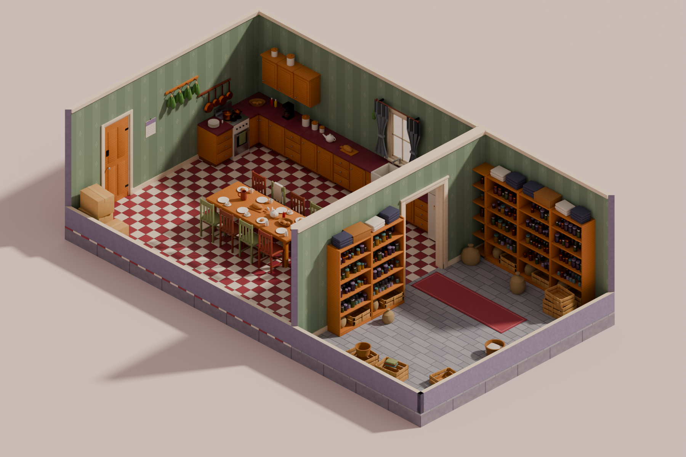

# Cozy Kitchen — 模块化场景资产包

参考图（等距小厨房 + 储藏室）在 Blender 中的模块化还原。

| 文件 | 说明 |
|---|---|
| `CozyKitchen_Modular.blend` | 全部模型、材质、两个房间 Prefab、预览相机/灯光（Blender 5.0） |
| `Textures/` | 41 套 PBR 贴图（BaseColor / Normal / ORM），`.blend` 以相对路径 `//Textures/` 引用 |
| `Previews/` | Cycles 预览图：`prefab_kitchen_pantry.png`、`asset_library.png` |
| `docs/gemini_texture_prompts.md` | 每张贴图对应的 Gemini 生成提示词（替换占位贴图用） |
| `tools/blender_build/` | 生成整个 `.blend` 的脚本（可复现，改尺寸只改常量） |



---

## 1. 网格与尺寸规范

| 项 | 值 |
|---|---|
| 网格单位 U | **1 m** |
| 允许的模块尺寸 | 只允许 **整数或半格**（0.5 / 1 / 1.5 / 2 / 3 …），不出现 1.25、0.875 这类非整数尺寸 |
| 地面 | `1x1`（1 m × 1 m，厚 0.05，顶面 z = 0） |
| 地基 | `1x1`（z −0.35 … −0.05） |
| 墙高 | **3U = 3 m**（墙模块统一 `1x3`，2 m 高放不下 2.1 m 的门） |
| 墙皮厚 T | 0.1 m：墙从网格线向房间内侧占 T。两个房间背靠背时合成 0.2 m 墙，**不重叠、不 Z-fight** |
| 家具宽度 | 0.5 / 1 格；柜体深度属于格内细节，不参与网格 |

> 墙厚 0.1、踢脚线 0.02 等属于“模块内部细节”，不是模块尺寸；所有模块的**占格尺寸**和**对齐点**都在整数/半格上。

## 2. 轴向与 Pivot 约定

* **结构模块（地面 / 墙 / 门窗 / 门框）**：Pivot 在网格角点 `(0,0,0)`；模块沿 **+X** 延伸，**房间内侧为 +Y**，墙体占 `y = 0 … T`。
  放到房间四边只需绕 Z 旋转 0 / 90 / 180 / −90°，并保持同一套对齐。
* **门框 / 窗框 / 窗玻璃 / 窗帘杆**：与所在墙模块 **同一个 Pivot**，直接与墙同变换摆放即可。
* **靠墙家具**（橱柜、吊柜、灶台、冰箱、货架、挂杆）：Pivot 在 **后-左-底**，宽度 +X，深度 +Y，与墙同一坐标系，摆放时偏移 `y = T`。
* **自由道具**（盘子、罐子、箱子…）：Pivot 在 **底面中心**。
* **门扇** `SM_Door_4Panel`：Pivot 在合页轴；放在墙局部 `(DOOR.x0 + 0.04, T − 0.05, 0)`。
* **挂锅** `SM_Pan_Copper_*`：Pivot 在挂孔；**草药束**：Pivot 在顶部挂点；**窗帘**：Pivot 在顶部中点。

## 3. 结构模块清单（`00_Library`）

| 分类 | 资产 | 占格 | 备注 |
|---|---|---|---|
| 地面 | `SM_Floor_Checker_1x1` | 1×1 | 红白棋盘格，一格 4×4 块 |
| | `SM_Floor_PlankGrey_1x1` | 1×1 | 灰木地板（储藏室） |
| | `SM_Foundation_1x1` | 1×1 | 石材地基（立体剖面外沿） |
| | `SM_Rug_Runner_1x3` | 1×3 | 独立 UV（0-1 铺满），可跨格 |
| 墙 | `SM_Wall_1x3` | 1×3 | 标准墙：壁纸（内）/ 灰紫抹灰（外）/ 米色压顶 + 踢脚 + 顶线 |
| | `SM_Wall_05x3` | 0.5×3 | 半格墙，补缝用 |
| | `SM_Wall_1x3_CornerL` / `_CornerR` | 1×3 | **内角墙**：长度仍是 1 格，在起点/终点做 45° 斜切；房间四个角两侧各放一个，正好闭合 |
| | `SM_Wall_Door_1x3` | 1×3 | 门洞 0.8 × 2.1，socket `Door_1x3` |
| | `SM_Wall_Window_1x3` | 1×3 | 窗洞 0.7 × 1.2（z 1.0 – 2.2） |
| | `SM_Wall_Doorway_2x3` | 2×3 | 宽门洞 1.2 × 2.2，socket `Doorway_2x3` |
| | `SM_Wall_Low_1x05` | 1×0.5 | 剖面矮墙（等距视角下的前墙） |
| | `SM_Wall_OuterPost` | T×T | 外凸角补柱（L 形房间用） |
| 门窗 | `SM_DoorFrame_1x3` | 1×3 | 门套：贴脸 + 门洞内衬（每侧房间一套） |
| | `SM_Door_4Panel` | — | 四格门扇 + 把手 + 铁合页 |
| | `SM_DoorFrame_Wide_2x3` | 2×3 | 宽门洞门套 |
| | `SM_Window_Frame_1x3` / `SM_Window_Glass_1x3` | 1×3 | 窗框、窗台、窗格 / 玻璃 |
| | `SM_Curtain_Rod_1U` / `SM_Curtain_Panel` | — | 窗帘杆、束起的窗帘 |

**开口规则**：门 / 窗 / 宽门洞不能放在房间的首尾格（角格），角格固定用 `CornerL / CornerR`。

## 4. 房间 Prefab 与随机房间生成

`10_Prefabs` 下是两个固定 Prefab，全部由库资产的 **Linked Duplicate** 组成（改库里的网格，Prefab 同步更新）：

| Prefab | 尺寸 | 连接点 |
|---|---|---|
| `PF_Kitchen` | 7 × 6 | 西墙外门 `Door_1x3`（y 1–2）、东墙宽门洞 `Doorway_2x3`（y 3–5） |
| `PF_Pantry` | 4 × 6 | 西墙宽门洞 `Doorway_2x3`（y 3–5），与厨房东门洞对齐 |

每个 Prefab 的子集合：`_Structure`（地面/墙/门窗）、`_CutawayWalls`（朝向镜头的墙，默认隐藏，游戏里全封闭时打开）、`_Props`、`_Gameplay`。

`_Gameplay` 内的对象（渲染隐藏）：

| 对象 | 作用 | 自定义属性 |
|---|---|---|
| `CONN_<Room>_NN`（单箭头 Empty） | 门的连接 Socket，位于门洞中心地面、网格线上，**箭头 = 朝外方向** | `connector`, `conn_type`, `width_u`, `room_id` |
| `TRG_<Room>_NN`（线框盒） | 门的触发碰撞体：宽 = 门洞宽，从墙向内 0.9 m，高 = 门洞高 | `trigger`, `connector`, `on_enter = spawn_or_load_neighbour_room` |
| `BOUNDS_<Room>` | 房间包围盒 nx × ny × 3 | `room_bounds`，放置新房间前做重叠检测 |
| `UCX_<Mesh>_NN` | 静态碰撞体（UE/Unity 通用命名，挂在模型下） | `collider = convex` |

**生成流程（约定，未写代码）**：玩家进入 `TRG_` → 取对应 `CONN_` → 从房间池中挑一个有 **相同 `conn_type`** 连接点的 Prefab → 旋转使两个 Socket **位置重合、朝向相反** → 用 `BOUNDS_` 检测重叠，失败换下一个 → 放置。门扇只由其中一侧生成一次。因为两边墙都只向各自房间内侧占 T，对接后墙厚 0.2 m，门洞、门套自然对齐。

`00_Library/09_Gameplay_Templates` 中有一个单独的 Door 连接点示例。

## 5. 材质 / PBR / UV

* 统一 **Principled BSDF 金属度流程**，每个材质三张贴图：
  * `T_<Name>_BaseColor.png` — sRGB
  * `T_<Name>_Normal.png` — OpenGL（+Y 向上）
  * `T_<Name>_ORM.png` — R = AO，G = Roughness，B = Metallic（Unreal 标准打包；Unity HDRP 需要改通道）
* **UVMap（UV0）**：按世界尺寸投影，**纹素密度统一**。建筑贴图 1024 px 覆盖 1 格（1 m）；小道具用 128–512 px 的平铺贴图，每个材质的覆盖尺寸记录在材质自定义属性 `tile_m`。
  旋转体（罐、锅、瓶子、篮子）用柱面展开，缝在背面；地毯、日历、便签用 0-1 独立 UV。
* **UVLightmap（UV1）**：每个网格都有一套不重叠的 Smart UV，用于光照贴图 / AO 烘焙。
* 倒角：大部分道具有 2 段倒角 + 按角度平滑，远看圆润、近看不糊。

## 6. 贴图与 Gemini

本次构建在云端容器里完成，**容器中没有你本机登录的 Gemini**，所以 `Textures/` 里目前是程序化生成的**可平铺占位 PBR 贴图**（能直接用，风格与参考图一致）。
`docs/gemini_texture_prompts.md` 给出了每张 BaseColor 的 Gemini 提示词：在本机用 Gemini 生成后，**按同名覆盖** `T_<Name>_BaseColor.png`，打开 `.blend` 即自动更新；Normal / ORM 可以保留，也可以用 Materialize、Substance Sampler 从新 BaseColor 推导。

## 7. 浏览 `.blend`

* `00_Library`：按分类排成行、间距 0.3 m，每个资产下方有名称标签（`99_Labels`，导出时排除即可）。用 `CAM_Library` 相机浏览（从 +Y 方向看，所有墙面/柜门正面朝向镜头）。
* `10_Prefabs`：拼好的厨房 + 储藏室，用 `CAM_Prefab_Iso` 相机查看（正交等距）。
* 碰撞体、触发器、包围盒默认在视口里隐藏：`Alt + H` 显示。

## 8. 重新生成

```bash
pip install bpy          # Blender 5.0 的 Python 模块，或用 blender -b -P
python tools/blender_build/textures.py Textures      # 重新生成占位贴图
python tools/blender_build/build_scene.py            # 生成 .blend + 预览图（--no-render 跳过渲染）
```

网格尺寸、墙高、墙厚只在 `tools/blender_build/kit.py` 顶部的 `GRID / H / T` 三个常量里。
